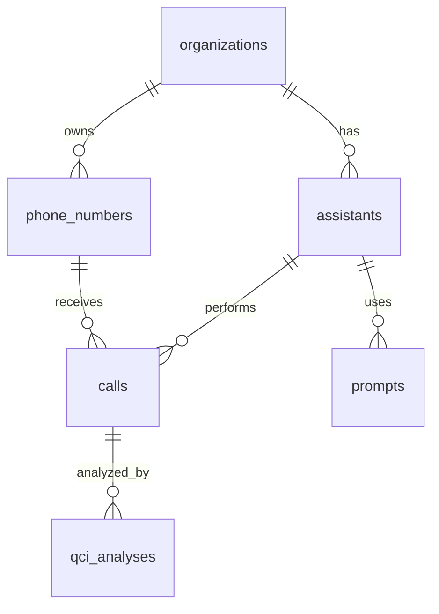

# 🗄️ VAPI Supabase Database Setup

Полная настройка базы данных Supabase для VAPI Analytics с миграцией всех существующих данных.

---

## 📋 Быстрый старт

### 1. **Создание таблиц в Supabase**

#### Через Supabase Dashboard:
1. Откройте https://supabase.com/dashboard → ваш проект
2. SQL Editor → New Query
3. Скопируйте содержимое файла `migrations/001_create_tables.sql`
4. Выполните запрос
5. Повторите с `migrations/002_create_indexes_and_rls.sql`

#### Через Claude MCP (если настроен):
```
"Подключись к supabase-vapi и выполни миграции из файлов:
- database/migrations/001_create_tables.sql
- database/migrations/002_create_indexes_and_rls.sql"
```

### 2. **Миграция данных**

```bash
# Установить зависимости если не установлены
npm install @supabase/supabase-js

# Запустить миграцию (сначала тестовый режим)
node production_scripts/supabase_migration/migrate_to_supabase.js

# После проверки - полная миграция
# Отредактируйте CONFIG.DRY_RUN = false в скрипте
node production_scripts/supabase_migration/migrate_to_supabase.js
```

### 3. **Проверка**
```sql
-- Проверьте количество записей
SELECT
    'calls' as table_name, COUNT(*) as count FROM calls
UNION ALL
SELECT
    'qci_analyses' as table_name, COUNT(*) FROM qci_analyses
UNION ALL
SELECT
    'assistants' as table_name, COUNT(*) FROM assistants;

-- Обновите аналитические представления
SELECT refresh_analytics_views();
```

---

## 🏗️ Структура базы данных



### 📊 Основные таблицы:

| Таблица | Описание | Записей (примерно) |
|---------|----------|-------------------|
| **organizations** | Клиенты/организации | 1-10 |
| **assistants** | AI ассистенты | 10-50 |
| **calls** | Все звонки VAPI | 2000+ |
| **qci_analyses** | Анализ качества | 2000+ |
| **prompts** | Версии промптов | 50+ |
| **prompt_optimizations** | Рекомендации | 20+ |

---

## 📈 Аналитические запросы

### Топ ассистенты по QCI:
```sql
SELECT
    a.name,
    COUNT(q.id) as total_analyses,
    ROUND(AVG(q.qci_total_score), 1) as avg_qci,
    ROUND(AVG(c.cost), 4) as avg_cost
FROM assistants a
JOIN calls c ON a.id = c.assistant_id
JOIN qci_analyses q ON c.id = q.call_id
WHERE c.started_at > NOW() - INTERVAL '30 days'
GROUP BY a.name
ORDER BY avg_qci DESC;
```

### Динамика звонков по дням:
```sql
SELECT
    DATE_TRUNC('day', started_at) as date,
    COUNT(*) as calls_count,
    AVG(cost) as avg_cost,
    SUM(cost) as total_cost
FROM calls
WHERE started_at > NOW() - INTERVAL '30 days'
GROUP BY DATE_TRUNC('day', started_at)
ORDER BY date DESC;
```

### QCI по категориям:
```sql
SELECT
    CASE
        WHEN qci_total_score >= 80 THEN 'Excellent (80+)'
        WHEN qci_total_score >= 60 THEN 'Good (60-79)'
        WHEN qci_total_score >= 40 THEN 'Fair (40-59)'
        ELSE 'Poor (<40)'
    END as qci_category,
    COUNT(*) as count,
    ROUND(AVG(qci_total_score), 1) as avg_score
FROM qci_analyses
WHERE analyzed_at > NOW() - INTERVAL '30 days'
GROUP BY 1
ORDER BY avg_score DESC;
```

---

## 🔒 Безопасность (RLS)

База данных настроена с Row Level Security:

```sql
-- Установка текущей организации пользователя
SET app.current_org_id = 'your-org-uuid-here';

-- Теперь все запросы будут видеть только данные этой организации
SELECT * FROM calls; -- только звонки организации
```

### Создание пользователей:
```sql
-- Создание роли для аналитика
CREATE ROLE analytics_user;
GRANT SELECT ON ALL TABLES IN SCHEMA public TO analytics_user;

-- Создание роли для менеджера
CREATE ROLE manager_user;
GRANT SELECT, INSERT, UPDATE ON ALL TABLES IN SCHEMA public TO manager_user;
```

---

## 🚀 Производительность

### Основные индексы созданы для:
- ✅ Поиск по времени звонков (`idx_calls_started_at`)
- ✅ Фильтрация по ассистентам (`idx_calls_assistant_id`)
- ✅ QCI аналитика (`idx_qci_analyses_qci_total_score`)
- ✅ Полнотекстовый поиск (`idx_calls_search_vector`)

### Материализованные представления:
- `daily_assistant_stats` - ежедневная статистика по ассистентам

### Обновление аналитики:
```sql
-- Обновлять каждый день
SELECT refresh_analytics_views();

-- Или настроить cron job в Supabase
SELECT cron.schedule('refresh-analytics', '0 6 * * *', 'SELECT refresh_analytics_views();');
```

---

## 📊 Мониторинг и метрики

### Размер таблиц:
```sql
SELECT
    schemaname,
    tablename,
    attname,
    n_distinct,
    correlation
FROM pg_stats
WHERE schemaname = 'public' AND tablename IN ('calls', 'qci_analyses')
ORDER BY tablename, attname;
```

### Производительность запросов:
```sql
-- Включить если нужно
-- CREATE EXTENSION IF NOT EXISTS pg_stat_statements;

SELECT
    query,
    calls,
    total_time,
    mean_time,
    rows
FROM pg_stat_statements
WHERE query LIKE '%calls%' OR query LIKE '%qci%'
ORDER BY total_time DESC
LIMIT 10;
```

---

## 🔧 Устранение неполадок

### Проблема: Миграция падает с ошибкой
```bash
# Проверьте подключение
node -e "console.log(process.env.SUPABASE_URL, process.env.SUPABASE_ANON_KEY)"

# Проверьте права доступа в Supabase Dashboard → Settings → API
```

### Проблема: Медленные запросы
```sql
-- Проверьте использование индексов
EXPLAIN ANALYZE SELECT * FROM calls WHERE started_at > NOW() - INTERVAL '7 days';

-- Обновите статистику
ANALYZE calls;
ANALYZE qci_analyses;
```

### Проблема: RLS блокирует доступ
```sql
-- Временно отключить RLS для администрирования
ALTER TABLE calls DISABLE ROW LEVEL SECURITY;

-- Не забудьте включить обратно!
ALTER TABLE calls ENABLE ROW LEVEL SECURITY;
```

---

## 📁 Файлы проекта

```
database/
├── README.md                          # Эта документация
├── migrations/
│   ├── 001_create_tables.sql         # Создание таблиц
│   └── 002_create_indexes_and_rls.sql # Индексы и безопасность
└── docs/
    └── Supabase_Database_Schema.md   # Детальная схема

production_scripts/supabase_migration/
└── migrate_to_supabase.js            # Скрипт миграции данных
```

---

## 🎯 Следующие шаги

1. ✅ Создать таблицы в Supabase
2. ✅ Мигрировать исторические данные
3. 🔄 Настроить регулярную синхронизацию с VAPI API
4. 📊 Создать дашборды в Grafana/Metabase
5. 🤖 Настроить автоматические отчеты
6. 📈 Настроить алерты по QCI метрикам

**База данных готова к production использованию! 🚀**