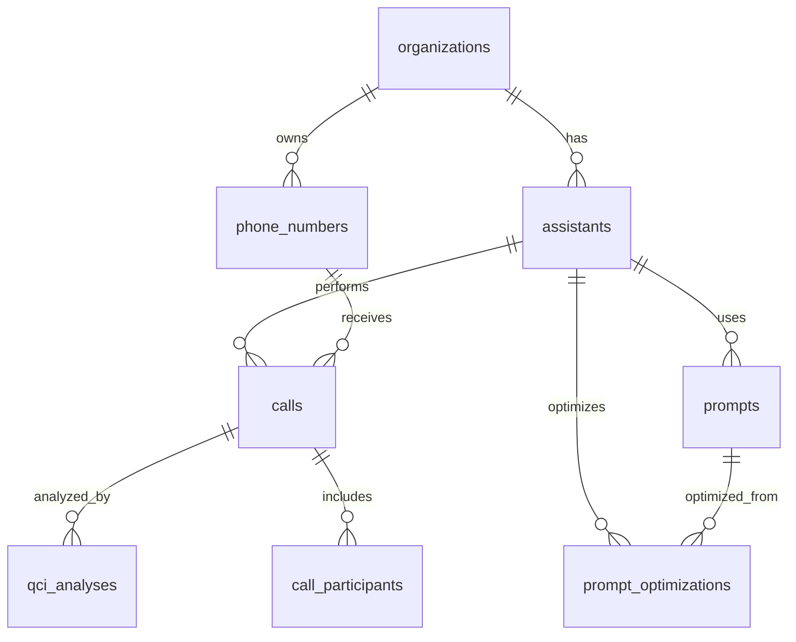

# 🏗️ Supabase Database Schema для VAPI Analytics

## 📊 Обзор архитектуры

Схема базы данных разработана для хранения всех данных VAPI с поддержкой аналитики, масштабируемости и безопасности.



---

## 🗂️ Структура таблиц

### 1. **organizations** - Организации/Клиенты
```sql
-- Разделение по клиентам для мультитенантности
CREATE TABLE organizations (
    id UUID PRIMARY KEY DEFAULT gen_random_uuid(),
    name VARCHAR(255) NOT NULL,
    vapi_org_id UUID UNIQUE, -- из VAPI API
    created_at TIMESTAMPTZ DEFAULT NOW(),
    updated_at TIMESTAMPTZ DEFAULT NOW(),
    settings JSONB DEFAULT '{}',
    is_active BOOLEAN DEFAULT TRUE
);
```

### 2. **assistants** - AI Ассистенты
```sql
-- Все ассистенты с их конфигурацией
CREATE TABLE assistants (
    id UUID PRIMARY KEY DEFAULT gen_random_uuid(),
    vapi_assistant_id UUID UNIQUE NOT NULL, -- из VAPI API
    organization_id UUID REFERENCES organizations(id),
    name VARCHAR(255) NOT NULL,
    current_prompt_id UUID, -- связь с активным промптом
    configuration JSONB DEFAULT '{}', -- полная VAPI конфигурация
    is_active BOOLEAN DEFAULT TRUE,
    created_at TIMESTAMPTZ DEFAULT NOW(),
    updated_at TIMESTAMPTZ DEFAULT NOW()
);
```

### 3. **prompts** - Версии промптов
```sql
-- История промптов для каждого ассистента
CREATE TABLE prompts (
    id UUID PRIMARY KEY DEFAULT gen_random_uuid(),
    assistant_id UUID REFERENCES assistants(id),
    version INTEGER NOT NULL,
    content TEXT NOT NULL,
    is_current BOOLEAN DEFAULT FALSE,
    created_at TIMESTAMPTZ DEFAULT NOW(),
    created_by UUID, -- кто создал промпт
    performance_notes TEXT,
    UNIQUE(assistant_id, version)
);
```

### 4. **phone_numbers** - Телефонные номера
```sql
-- Номера для входящих/исходящих звонков
CREATE TABLE phone_numbers (
    id UUID PRIMARY KEY DEFAULT gen_random_uuid(),
    vapi_phone_id UUID UNIQUE, -- из VAPI API
    organization_id UUID REFERENCES organizations(id),
    phone_number VARCHAR(20) NOT NULL,
    country_code VARCHAR(5),
    is_active BOOLEAN DEFAULT TRUE,
    created_at TIMESTAMPTZ DEFAULT NOW()
);
```

### 5. **calls** - Основная таблица звонков ⭐
```sql
-- Все звонки с полной информацией
CREATE TABLE calls (
    id UUID PRIMARY KEY DEFAULT gen_random_uuid(),
    vapi_call_id UUID UNIQUE NOT NULL, -- из VAPI API
    assistant_id UUID REFERENCES assistants(id),
    phone_number_id UUID REFERENCES phone_numbers(id),
    organization_id UUID REFERENCES organizations(id),

    -- Метаданные звонка
    call_type VARCHAR(50) NOT NULL, -- 'inbound', 'outbound'
    status VARCHAR(50) NOT NULL, -- 'ended', 'in-progress', etc.
    ended_reason VARCHAR(100),

    -- Временные метки
    started_at TIMESTAMPTZ,
    ended_at TIMESTAMPTZ,
    duration_seconds INTEGER GENERATED ALWAYS AS
        (EXTRACT(EPOCH FROM (ended_at - started_at))) STORED,

    -- Контент
    transcript TEXT,
    summary TEXT,
    recording_url TEXT,

    -- Участники
    customer_number VARCHAR(20),
    customer_info JSONB DEFAULT '{}',

    -- Метрики
    cost DECIMAL(10,6),

    -- Системные поля
    created_at TIMESTAMPTZ DEFAULT NOW(),
    updated_at TIMESTAMPTZ DEFAULT NOW(),
    raw_data JSONB -- полные сырые данные из VAPI
);
```

### 6. **qci_analyses** - Анализ качества звонков 🎯
```sql
-- QCI анализ для каждого звонка
CREATE TABLE qci_analyses (
    id UUID PRIMARY KEY DEFAULT gen_random_uuid(),
    call_id UUID REFERENCES calls(id) UNIQUE, -- один анализ на звонок
    assistant_id UUID REFERENCES assistants(id),

    -- QCI метрики (0-100)
    qci_total_score INTEGER CHECK (qci_total_score >= 0 AND qci_total_score <= 100),
    dynamics_score INTEGER CHECK (dynamics_score >= 0 AND dynamics_score <= 30),
    objections_score INTEGER CHECK (objections_score >= 0 AND objections_score <= 20),
    brand_score INTEGER CHECK (brand_score >= 0 AND brand_score <= 20),
    outcome_score INTEGER CHECK (outcome_score >= 0 AND outcome_score <= 30),

    -- Статус анализа
    status VARCHAR(20) DEFAULT 'pass', -- 'pass', 'review', 'fail'

    -- Детальный анализ
    evidence JSONB DEFAULT '{}', -- agent_talk_ratio, brand_mentions, outcomes
    coaching_tips TEXT[],
    key_moments TEXT[],

    -- Метаданные анализа
    ai_model VARCHAR(50), -- 'gpt-4o-mini', 'gpt-4o'
    analysis_cost DECIMAL(10,6),
    tokens_used INTEGER,
    analyzed_at TIMESTAMPTZ DEFAULT NOW(),

    raw_analysis JSONB -- полный ответ от AI
);
```

### 7. **prompt_optimizations** - Оптимизация промптов 🚀
```sql
-- Рекомендации по улучшению промптов
CREATE TABLE prompt_optimizations (
    id UUID PRIMARY KEY DEFAULT gen_random_uuid(),
    assistant_id UUID REFERENCES assistants(id),
    original_prompt_id UUID REFERENCES prompts(id),

    -- Текущая производительность
    current_performance JSONB DEFAULT '{}', -- avg_qci, total_calls, success_rate, etc.

    -- Рекомендации
    target_qci INTEGER,
    improvement_potential VARCHAR(50), -- "+15 points"
    primary_focus_area TEXT,
    recommended_prompt TEXT,

    -- Рекомендации Hormozi
    hormozi_recommendations JSONB DEFAULT '[]',
    implementation_plan JSONB DEFAULT '{}',

    -- Метаданные
    generated_at TIMESTAMPTZ DEFAULT NOW(),
    ai_model VARCHAR(50),
    analysis_cost DECIMAL(10,6),
    is_implemented BOOLEAN DEFAULT FALSE,
    implementation_date TIMESTAMPTZ,

    raw_recommendations JSONB -- полный анализ
);
```

### 8. **call_participants** - Участники звонков (опционально)
```sql
-- Детализация участников для сложных звонков
CREATE TABLE call_participants (
    id UUID PRIMARY KEY DEFAULT gen_random_uuid(),
    call_id UUID REFERENCES calls(id),
    participant_type VARCHAR(20) NOT NULL, -- 'agent', 'customer', 'transfer'
    participant_name VARCHAR(255),
    phone_number VARCHAR(20),
    join_time TIMESTAMPTZ,
    leave_time TIMESTAMPTZ,
    talk_time_seconds INTEGER,
    created_at TIMESTAMPTZ DEFAULT NOW()
);
```

---

## 📈 Индексы для производительности

```sql
-- Основные индексы для быстрых запросов
CREATE INDEX idx_calls_assistant_id ON calls(assistant_id);
CREATE INDEX idx_calls_started_at ON calls(started_at DESC);
CREATE INDEX idx_calls_organization_id ON calls(organization_id);
CREATE INDEX idx_calls_status ON calls(status);
CREATE INDEX idx_calls_cost ON calls(cost DESC);

-- QCI аналитика
CREATE INDEX idx_qci_analyses_qci_total_score ON qci_analyses(qci_total_score DESC);
CREATE INDEX idx_qci_analyses_assistant_id ON qci_analyses(assistant_id);
CREATE INDEX idx_qci_analyses_analyzed_at ON qci_analyses(analyzed_at DESC);

-- Промпты и оптимизация
CREATE INDEX idx_prompts_assistant_id ON prompts(assistant_id);
CREATE INDEX idx_prompts_is_current ON prompts(is_current) WHERE is_current = TRUE;
CREATE INDEX idx_prompt_optimizations_assistant_id ON prompt_optimizations(assistant_id);
```

---

## 🔒 Row Level Security (RLS)

```sql
-- Включаем RLS для всех таблиц
ALTER TABLE organizations ENABLE ROW LEVEL SECURITY;
ALTER TABLE assistants ENABLE ROW LEVEL SECURITY;
ALTER TABLE calls ENABLE ROW LEVEL SECURITY;
ALTER TABLE qci_analyses ENABLE ROW LEVEL SECURITY;

-- Политики доступа (пример)
CREATE POLICY "Users can view own organization data" ON calls
    FOR SELECT USING (organization_id = current_setting('app.current_org_id')::UUID);
```

---

## 🎯 Ключевые возможности схемы

### ✅ **Аналитические запросы:**
```sql
-- Топ ассистенты по QCI
SELECT a.name, AVG(q.qci_total_score) as avg_qci
FROM assistants a
JOIN qci_analyses q ON a.id = q.assistant_id
GROUP BY a.name ORDER BY avg_qci DESC;

-- Динамика звонков по времени
SELECT DATE_TRUNC('day', started_at) as date,
       COUNT(*) as calls_count,
       AVG(cost) as avg_cost
FROM calls
WHERE started_at > NOW() - INTERVAL '30 days'
GROUP BY date ORDER BY date;
```

### ✅ **Масштабируемость:**
- Партицирование по дате для таблицы calls
- JSONB для гибкого хранения метаданных
- UUID для распределенности

### ✅ **Безопасность:**
- RLS на уровне организации
- Аудит через updated_at поля
- Валидация данных через CHECK constraints

---

## 📊 Размер данных (оценка)

При **2000 звонков в месяц:**
- **calls**: ~2MB в месяц
- **qci_analyses**: ~1MB в месяц
- **Всего**: ~50MB в год

**Готова к масштабированию до миллионов звонков! 🚀**